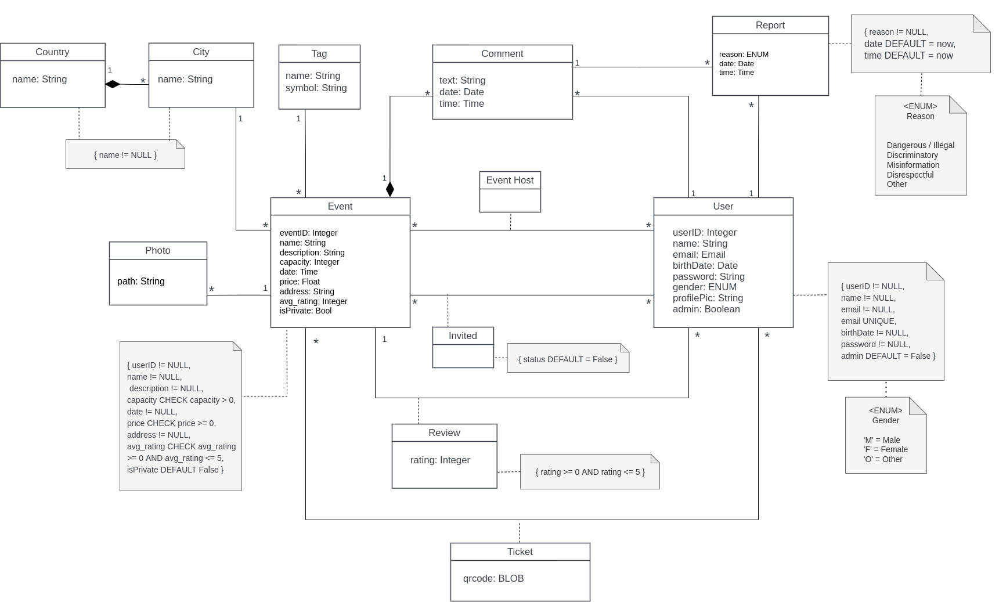

# EBD: Database Specification Component  
  
## A4: Conceptual Data Model  
  
In this artifact, the structure of the system is described from a data perspective, and all entities and their relationships are depicted via a UML class diagram. All of the significant relationships between classes are contained in it, and this type of information includes anything from straightforward class attributes to intricate connections that require analysis of the multiplicity of relations.  
  
### 1. Class diagram  
  
The UML diagram represents the architecture that will serve as a foundation for the database and presents the most important details.  


  
### 2. Additional Business Rules  
  
To complement the previous diagram, some rules or restrictions who do not have a place on the UML. This section is meant to represent these rules.  
  
| Identifier | Name        | Description                                    |
| ---------- | ----------- | ---------------------------------------------- |
| BR01       | Rating      | A user can only rate the events he attended    |
| BR02       | Event Photo | Only the event manager can add event photos |
---  
  
<div style="page-break-after: always;"></div>

## A5: Relational Schema, validation and schema refinement  
  
This artifact contains the relational schema mapped from the conceptual data model presented in artifact A4. For each relation, it depicts its schema, attributes, keys, domains and constraints. In this section the global schema is also checked for integrity using normal forms analysis, making sure that every relationship is in the Boyce-Codd Normal Form.
  
### 1. Relational Schema  
  
| Relation reference | Relation Compact Notation                                                                                                                                                                                                               |
| ------------------ | --------------------------------------------------------------------------------------------------------------------------------------------------------------------------------------------------------------------------------------- |
| R01                | user_(<ins>__userID__</ins>, name NN, email NN UK, birthDate NN, password NN, gender NN, profilePic, admin DF False)                                                                                                                    |
| R02                | event(<ins>__eventID__</ins>, name NN UK, description NN, capacity CK capacity > 0, date NN CK >= today, creationDate DF today, price CK >= 0, address NN, avg_rating CK >= 0 & & <= 5, idTag → Tag, idCity → City, isPrivate DF False) |
| R03                | photo(path NN, <ins>__eventID__</ins> → event NN)                                                                                                                                                                                       |
| R04                | tag(<ins> __tagID__ </ins>, name NN, symbol NN)                                                                                                                                                                                         |
| R05                | city(<ins> __cityID__ </ins>, name NN)                                                                                                                                                                                                  |
| R06                | country(<ins> __countryID__ </ins>, name NN)                                                                                                                                                                                            |
| R07                | ticket(<ins> __ticketID__ </ins>, qrcode, eventID → event NN, userID → user NN)                                                                                                                                                         |
| R08                | review(<ins> __reviewID__ </ins>, rating, eventID → event NN, userID → user NN)                                                                                                                                                         |
| R09                | comment(<ins>__commentID__</ins>, text NN, date DF today, time DF Now, userID → user NN, eventID → event NN)                                                                                                                            |
| R10                | report(<ins>__reportID__</ins>, description NN, date DF today, userID → user NN, commentID → comment)                                                                                                                                   |
| R11                | event_host(<ins>__userID__</ins> → user, <ins>__eventID__</ins> → event)                                                                                                                                                                |
| R12                | invited(status DF False, <ins>__userID__</ins> → user, <ins>__eventID__</ins> → event )                                                                                                                                                 |
  
### Legend:  
- **NN** = NOT NULL  
- **UK** = UNIQUE  
- **DF** = DEFAULT  
- **CK** = CHECK  

<div style="page-break-after: always;"></div>
  
### 2. Domains  
  
> The specification of additional domains can also be made in a compact form, using the notation:  
  
| Domain Name | Domain Specification                                                                     |
| ----------- | ---------------------------------------------------------------------------------------- |
| Today       | DATE DEFAULT CURRENT_DATE                                                                |
| Now         | TIMESTAMP DEFAULT CURRENT_TIMESTAMP                                                      |
| Genders     | ENUM ('M', 'F', 'O')                                                                     |
| Reason      | ENUM ('Dangerous/Illegal', 'Discriminatory', 'Misinformation', 'Disrespectful', 'Other') |
  
### 3. Schema validation  
  
To validate the database schema and ensure the integrity of the database, we need to analyze the functional dependencies and make sure that all of the relations are in the Boyce-Codd Normal Form (BCNF). The following tables represent the functional dependencies for every relation in the schema and the corresponding normal form.  
  
| **TABLE R01**                | user_                                                                  |
| ---------------------------- | ---------------------------------------------------------------------- |
| **Keys**                     | { userID, email }                                                      |
| **Functional Dependencies:** |                                                                        |
| FD0101                       | userID → {name, email, birthDate, password, gender, profilePic, admin} |
| FD0102                       | email → {userID, name, birthDate, password, gender, profilePic, admin} |
| **NORMAL FORM**              | BCNF                                                                   |

<br>

| **TABLE R02**                | event                                                                                                             |
| ---------------------------- | ----------------------------------------------------------------------------------------------------------------- |
| **Keys**                     | { eventID }                                                                                                       |
| **Functional Dependencies:** |                                                                                                                   |
| FD0201                       | eventID → {name, description, capacity, date, creationDate, price, address, avg_rating, idTag, idCity, isPrivate} |
| **NORMAL FORM**              | BCNF                                                                                                              |

<br>

| **TABLE R03**                | photo            |
| ---------------------------- | ---------------- |
| **Keys**                     | { eventID }      |
| **Functional Dependencies:** |                  |
| FD0301                       | eventID → {path} |
| **NORMAL FORM**              | BCNF             |

<br>

| **TABLE R04**                | tag                    |
| ---------------------------- | ---------------------- |
| **Keys**                     | { tagID }              |
| **Functional Dependencies:** |                        |
| FD0401                       | tagID → {name, symbol} |
| **NORMAL FORM**              | BCNF                   |

<br>

| **TABLE R05**                | city            |
| ---------------------------- | --------------- |
| **Keys**                     | { cityID }      |
| **Functional Dependencies:** |                 |
| FD0501                       | cityID → {name} |
| **NORMAL FORM**              | BCNF            |

<br>
  
| **TABLE R06**                | country            |
| ---------------------------- | ------------------ |
| **Keys**                     | { countryID }      |
| **Functional Dependencies:** |                    |
| FD0601                       | countryID → {name} |
| **NORMAL FORM**              | BCNF               |

<br>
  
| **TABLE R07**                | ticket                               |
| ---------------------------- | ------------------------------------ |
| **Keys**                     | { ticketID, qrcode }                 |
| **Functional Dependencies:** |                                      |
| FD0701                       | ticketID → {qrcode, eventID, userID} |
| FD0702                       | qrcode → {ticketID}                  |
| **NORMAL FORM**              | BCNF                                 |

<br>
  
| **TABLE R08**                | review                               |
| ---------------------------- | ------------------------------------ |
| **Keys**                     | { reviewID }                         |
| **Functional Dependencies:** |                                      |
| FD0801                       | reviewID → {rating, eventID, userID} |
| **NORMAL FORM**              | BCNF                                 |

<br>
<div style="page-break-after: always;"></div>

| **TABLE R09**                | comment                                         |
| ---------------------------- | ----------------------------------------------- |
| **Keys**                     | { commentID }                                   |
| **Functional Dependencies:** |                                                 |
| FD0901                       | commentID → {text, date, time, idUser, idEvent} |
| **NORMAL FORM**              | BCNF                                            |

<br>
  
| **TABLE R10**                | report                                            |
| ---------------------------- | ------------------------------------------------- |
| **Keys**                     | { reportID }                                      |
| **Functional Dependencies:** |                                                   |
| FD1001                       | reportID → {description, date, idUser, idComment} |
| **NORMAL FORM**              | BCNF                                              |

<br>
  
| **TABLE R11**                | event_host        |
| ---------------------------- | ----------------- |
| **Keys**                     | {userID, eventID} |
| **Functional Dependencies:** |                   |
| None                         |                   |
| **NORMAL FORM**              | BCNF              |

<br>
  
| **TABLE R12**                | invited                      |
| ---------------------------- | ---------------------------- |
| **Keys**                     | {userID, eventID}            |
| **Functional Dependencies:** |                              |
| FD1201                       | {userID, eventID} → {status} |
| **NORMAL FORM**              | BCNF                         |
  
All relations are in BCNF: for each functional dependency A -> B, A is a super key.  
Because of this, the schema is also in the BCNF and no further normalization is necessary.

<div style="page-break-after: always;"></div>
  
## A6: Indexes, triggers, transactions and database population  
  
This artifact contains details about the database (estimated workload) as well as the identification and characterization of indexes, the rules for data integrity defined by triggers and the transactions defined to provide reliable units of work that allow correct recovery from failures and keep consistency even in cases of system failure. 
  
### 1. Database Workload  
  
| Relation | Relation name        | Order of magnitude       | Estimated growth     |
| -------- | -------------------- | ------------------------ | -------------------- |
| R01      | User                 | 20 k (tens of thousands) | 100 (hundreds) / day |
| R02      | Unauthenticated User | 12 k (thousands)         | 70 (tens) / day      |
| R03      | Authenticated User   | 8 k (thousands)          | 30 (tens) / day      |
| R04      | Attendee             | 2 k (thousands)          | 5 (units) / day      |
| R05      | Event Organizer      | 800 (hundreds)           | 1 (units) / day      |
| R06      | Comment Author       | 5 k (thousands)          | 23 (tens) /day       |
| R07      | Administrator        | 200 (hundreds)           | 1 (units) / day      |
  

### 2. Proposed Indices  
  
#### 2.1. Performance Indices  
  
> Indices proposed to improve the performance of the identified queries.  
  
| **Index**         | IDX01                                                                                                                                                                                                                                                                                                                                                                                                                                                                                                                                            |
| ----------------- | ------------------------------------------------------------------------------------------------------------------------------------------------------------------------------------------------------------------------------------------------------------------------------------------------------------------------------------------------------------------------------------------------------------------------------------------------------------------------------------------------------------------------------------------------ |
| **Relation**      | R01 - user_                                                                                                                                                                                                                                                                                                                                                                                                                                                                                                                                      |
| **Attribute**     | email                                                                                                                                                                                                                                                                                                                                                                                                                                                                                                                                            |
| **Type**          | Hash                                                                                                                                                                                                                                                                                                                                                                                                                                                                                                                                             |
| **Cardinality**   | High                                                                                                                                                                                                                                                                                                                                                                                                                                                                                                                                             |
| **Clustering**    | No                                                                                                                                                                                                                                                                                                                                                                                                                                                                                                                                               |
| **Justification** | A query that will be frequently made is retrieving the user data for a certain user id, for example, to display customized pages and events. As this will be used on a large scale, we can create a hash index for the name, which will result in faster and more efficient querying. Initially, we considered implementing this index for the email of the user, however, as we could not implement indexes for unique keys (according to the checklist) and the user email is covered by a unique constraint, we opted for the name attribute. |
| `SQL code`        | CREATE INDEX user_name ON user_ USING HASH(name)                                                                                                                                                                                                                                                                                                                                                                                                                                                                                                 |

```sql
CREATE INDEX user_name ON User USING HASH(name)
```

| **Index**         | IDX02                                                                                                                                                                                                                                                                                                                             |
| ----------------- | --------------------------------------------------------------------------------------------------------------------------------------------------------------------------------------------------------------------------------------------------------------------------------------------------------------------------------- |
| **Relation**      | R02 - event                                                                                                                                                                                                                                                                                                                       |
| **Attribute**     | date                                                                                                                                                                                                                                                                                                                              |
| **Type**          | B-Tree                                                                                                                                                                                                                                                                                                                            |
| **Cardinality**   | High                                                                                                                                                                                                                                                                                                                              |
| **Clustering**    | No                                                                                                                                                                                                                                                                                                                                |
| **Justification** | Frequently, the users of the system will want to search for and order events by date. Taking this into account, we can create a B-Tree index that will significantly improve performance, making searching and displaying events by date much faster, as this type of index keeps keys in sorted order for sequential traversing. |
| `SQL code`        | CREATE INDEX event_date ON event USING BTREE(date)                                                                                                                                                                                                                                                                                |

```sql
CREATE INDEX event_date ON event USING BTREE(date)
```

| **Index**         | IDX03                                                                                                                                                                                                                                                                                                                                                                                                                         |
| ----------------- | ----------------------------------------------------------------------------------------------------------------------------------------------------------------------------------------------------------------------------------------------------------------------------------------------------------------------------------------------------------------------------------------------------------------------------- |
| **Relation**      | R02 - event                                                                                                                                                                                                                                                                                                                                                                                                                   |
| **Attribute**     | avg_rating                                                                                                                                                                                                                                                                                                                                                                                                                    |
| **Type**          | B-Tree                                                                                                                                                                                                                                                                                                                                                                                                                        |
| **Cardinality**   | High                                                                                                                                                                                                                                                                                                                                                                                                                          |
| **Clustering**    | Yes                                                                                                                                                                                                                                                                                                                                                                                                                           |
| **Justification** | One of the main focus of the homepage that is displayed when a user enters the app is displaying the most relevant information, which includes the events that will be taking place shortly or the events with the best rating by the users. For this second case, a query that would return the desired events by comparing and sorting their rating is necessary and can be optimized using a B-Tree index with clustering. |
| `SQL code`        | CREATE INDEX event_rating ON event USING BTREE(avg_rating); CLUSTER event USING event_rating                                                                                                                                                                                                                                                                                                                                  |

```sql
CREATE INDEX event_rating ON event USING BTREE(date);
CLUSTER event USING event_rating
```
<div style="page-break-after: always;"></div>

#### 2.2. Full-text Search Indices  
  
> The system being developed must provide full-text search features supported by PostgreSQL. Thus, it is necessary to specify the fields where the full-text search will be available and the associated setup, namely all necessary configurations, indexes definitions and other relevant details.  
  
| **Index**         | IDX04                                                                                                                                                                                                                                                                                                 |
| ----------------- | ----------------------------------------------------------------------------------------------------------------------------------------------------------------------------------------------------------------------------------------------------------------------------------------------------- |
| **Relation**      | R02 - event (with foreign keys to R05 - city and R06 - country)                                                                                                                                                                                                                                       |
| **Attribute**     | name, description, city.name, country.name                                                                                                                                                                                                                                                            |
| **Type**          | GIN                                                                                                                                                                                                                                                                                                   |
| **Clustering**    | No                                                                                                                                                                                                                                                                                                    |
| **Justification** | One of the main ways in which users will search for events is by using full-text search, either searching for the event name, description, city or country. The type of index chosen to achieve this objective is GIN because it can store a high amount of lexemes without degrading performance. |
| `SQL code`        | Depicted below                                                                                                                                                                                                                                                                                        |

```sql
--EVENT 

--add column to store computed tsvectors

ALTER TABLE Event
ADD COLUMN tsvectors TSVECTOR;

--function to update tsvectors when a new event is inserted (currently only for name and description of the event)

CREATE FUNCTION event_search_update() RETURNS TRIGGER AS $$
BEGIN
    IF TG_OP = 'INSERT' THEN 
        NEW.tsvectors = (
            setweight(to_tsvector('english', coalesce(NEW.name,'')), 'A') ||
            setweight(to_tsvector('english', coalesce(NEW.description,'')), 'B')
        );
    END IF;

    IF TG_OP = 'UPDATE' THEN 
        IF (NEW.name <> OLD.name OR NEW.description <> OLD.description) THEN
            NEW.tsvectors = (
                setweight(to_tsvector('english', coalesce(NEW.name,'')), 'A') ||
                setweight(to_tsvector('english', coalesce(NEW.description,'')), 'B')
            );
        END IF;
    END IF;
    RETURN NEW;
END $$
LANGUAGE plpgsql;

--create a trigger to execute the tsvector update function with each insert or update on event

CREATE TRIGGER tsvectorupdate BEFORE INSERT OR UPDATE 
    ON Event FOR EACH ROW EXECUTE PROCEDURE event_search_update();

 --create a GIN index for the tsvectors column

 CREATE INDEX event_search ON Event USING GIN(tsvectors);

--CITY 

--add column to store computed tsvectors

ALTER TABLE City
ADD COLUMN tsvectors_city TSVECTOR;

--function to update tsvectors when a new event is inserted

CREATE FUNCTION city_search_update() RETURNS TRIGGER AS $$
BEGIN
    IF TG_OP = 'INSERT' THEN 
        NEW.tsvectors_city = (
            setweight(to_tsvector('english', coalesce(NEW.name,'')), 'C')
        );
    END IF;

    IF TG_OP = 'UPDATE' THEN 
        IF (NEW.name <> OLD.name) THEN
            NEW.tsvectors_city = (
                setweight(to_tsvector('english', coalesce(NEW.name,'')), 'C')
            );
        END IF;
    END IF;
    RETURN NEW;
END $$
LANGUAGE plpgsql;

CREATE TRIGGER tsvectorupdate_city BEFORE INSERT OR UPDATE 
    ON City FOR EACH ROW EXECUTE PROCEDURE city_search_update();  --city
 
 --create a GIN index for the tsvectors_city column

 CREATE INDEX city_search ON City USING GIN(tsvectors_city);

--COUNTRY

--add column to store computed tsvectors

ALTER TABLE Country
ADD COLUMN tsvectors_country TSVECTOR;

--function to update tsvectors when a new event is inserted

CREATE FUNCTION country_search_update() RETURNS TRIGGER AS $$
BEGIN
    IF TG_OP = 'INSERT' THEN 
        NEW.tsvectors_country = (
            setweight(to_tsvector('english', coalesce(NEW.name,'')), 'C')
        );
    END IF;

    IF TG_OP = 'UPDATE' THEN 
        IF (NEW.name <> OLD.name) THEN
            NEW.tsvectors_country = (
                setweight(to_tsvector('english', coalesce(NEW.name,'')), 'C')
            );
        END IF;
    END IF;
    RETURN NEW;
END $$
LANGUAGE plpgsql;

CREATE TRIGGER tsvectorupdate_country BEFORE INSERT OR UPDATE 
    ON Country FOR EACH ROW EXECUTE PROCEDURE country_search_update();  --country

--create a GIN index for the tsvectors_country column

CREATE INDEX country_search ON Country USING GIN(tsvectors_country);
```

<div style="page-break-after: always;"></div>
  
### 3. Triggers  
  
> User-defined functions and trigger procedures that add control structures to the SQL language or perform complex computations, are identified and described to be trusted by the database server. Every kind of function (SQL functions, Stored procedures, Trigger procedures) can take base types, composite types, or combinations of these as arguments (parameters). In addition, every kind of function can return a base type or a composite type. Functions can also be defined to return sets of base or composite values.  
  
| **Trigger**     | TRIGGER01                                                                                                                                      |
| --------------- | ---------------------------------------------------------------------------------------------------------------------------------------------- |
| **Description** | When some user creates or updates a review, the event average rating must be updated so that it can be used for sorting or searching purposes. |
| `SQL code`      | Depicted below                                                                                                                                 |

 ```sql
CREATE FUNCTION update_event_rating () RETURNS TRIGGER AS
$BODY$
BEGIN
	UPDATE event
	SET
    avg_rating = ( SELECT AVG(rating)
    FROM review
    WHERE
    eventID = NEW.eventID
    );
	RETURN NEW;
END
$BODY$ 
LANGUAGE plpgsql;

CREATE TRIGGER event_avg_rating
	AFTER INSERT OR UPDATE OR DELETE ON review
	EXECUTE PROCEDURE update_event_rating ();  
```
  


| **Trigger**     | TRIGGER02                                                                                                       |
| --------------- | --------------------------------------------------------------------------------------------------------------- |
| **Description** | When a user tries to enroll in an event that is already at full capacity, an error message should be displayed. |
| `SQL code`      | Depicted below                                                                                                  |
```sql
CREATE FUNCTION check_capacity () RETURNS TRIGGER AS
$BODY$
BEGIN
	PERFORM capacity FROM event
	WHERE eventID = New.eventID;
    IF (SELECT capacity FROM event WHERE eventID = New.eventID AND capacity = 0) THEN RAISE EXCEPTION 'This event is already at full capacity';
	END IF;
	RETURN NEW;
END
$BODY$ 
LANGUAGE plpgsql;

CREATE TRIGGER check_event_capacity 
	BEFORE INSERT ON ticket
	EXECUTE PROCEDURE check_capacity ();
```


| **Trigger**     | TRIGGER03                                                                               |
| --------------- | --------------------------------------------------------------------------------------- |
| **Description** | When a ticket is deleted or bought, the corresponding event capacity should be updated. |
| `SQL code`      | Depicted below                                                                          |
```sql
CREATE FUNCTION _create_ticket () RETURNS TRIGGER AS 
$BODY$
BEGIN
	UPDATE event
	SET capacity = capacity - 1
	WHERE eventID = NEW.eventID;
	RETURN NEW;

END
$BODY$
LANGUAGE plpgsql;

CREATE FUNCTION _delete_ticket () RETURNS TRIGGER AS 
$BODY$ 
BEGIN
	UPDATE event
	SET capacity = capacity + 1
	WHERE eventID = NEW.eventID;
	RETURN NEW;
END 
$BODY$ 
LANGUAGE plpgsql;

CREATE TRIGGER delete_ticket AFTER DELETE ON ticket
EXECUTE PROCEDURE _delete_ticket();

CREATE TRIGGER create_ticket BEFORE INSERT ON ticket
EXECUTE PROCEDURE _create_ticket();
```

<div style="page-break-after: always;"></div>

### 4. Transactions  
  
> Transactions needed to assure the integrity of the data.  
  
| SQL Reference       | TR01                                                                                                                                                                                                                                                                                                                                                     |
| ------------------- | -------------------------------------------------------------------------------------------------------------------------------------------------------------------------------------------------------------------------------------------------------------------------------------------------------------------------------------------------------- |
| Justification       | When a user is deleted, it is necessary to do actins in all of the data related to that user, such as comments, reports, reviews, tickets, invites, event host data, etc. The isolation level is Read Committed, because a table containing information about a user whose information is currently being deleted, might be read during the transaction. |
| Isolation level     | READ COMMITTED                                                                                                                                                                                                                                                                                                                                           |
| `Complete SQL Code` | Presented below                                                                                                                                                                                                                                                                                                                                          |

```sql
BEGIN TRANSACTION;

SET TRANSACTION ISOLATION LEVEL READ COMMITTED;

-- Delete user from user table
DELETE FROM user_
WHERE userID = $userID;

-- Delete user comments 
DELETE FROM comment
WHERE userID = $userID;

-- Delete user reports
DELETE FROM report
WHERE userID = $userID;

-- Delete user reviews
DELETE FROM review
WHERE userID = $userID;

-- Delete user tickets
DELETE FROM ticket
WHERE userID = $userID;

-- Delete invites of user
DELETE FROM invited
WHERE userID = $userID;

-- In the eventHost table, update with a new ID if the user was an host
SELECT * from event_host
where event_host = $eventID;

if found then

    UPDATE event_host
    SET userID = $newHostID, 
    WHERE userID = $userID;

end if;

END TRANSACTION;
```

| SQL Reference       | TR02                                                                                                                                                                                      |
| ------------------- | ----------------------------------------------------------------------------------------------------------------------------------------------------------------------------------------- |
| Justification       | In the middle of the transaction, the insertion of new rows in the tag table can occur, which implies that the same tag might be created twice, consequently resulting in a Phantom Read. |
| Isolation level     | SERIALIZABLE READ                                                                                                                                                                         |
| `Complete SQL Code` | Presented below                                                                                                                                                                           |

```sql
BEGIN TRANSACTION;

SET TRANSACTION ISOLATION LEVEL SERIALIZABLE READ;

SELECT tagID 
FROM tag
WHERE LOWER(name) = LOWER($tagName); --Convert everything to lowercase to make sure that tags are compared correctly

if not found then

    INSERT INTO tag(name, symbol)
    VALUES ($tagName, $tagSymbol)

end if;

WITH eventTag AS (
    SELECT tagID 
    FROM tag
    WHERE LOWER(name) = LOWER($tagName)
)

INSERT INTO event (name, description, capacity, date, creationDate, price, address, tagID, cityID) 
VALUES ($eventName, $eventDescription, $eventCapacity, $eventDate, now(), $eventPrice, $eventAddress, eventTag, $eventCityID);

END TRANSACTION;
```

| SQL Reference       | TR03                                                                                                                                                                                                                                                  |
| ------------------- | ----------------------------------------------------------------------------------------------------------------------------------------------------------------------------------------------------------------------------------------------------- |
| Justification       | When deleting an event, the related data must be correctly handled. The isolation level is Read Committed, because, a table containing information about an event whose information is currently being deleted, might be read during the transaction. |
| Isolation level     | READ COMMITTED                                                                                                                                                                                                                                        |
| `Complete SQL Code` | Presented below                                                                                                                                                                                                                                       |

```sql
BEGIN TRANSACTION;

SET TRANSACTION ISOLATION LEVEL READ COMMITTED;

-- delete event
DELETE FROM event
WHERE eventID = $eventID;

-- delete event_host
DELETE FROM event_host
WHERE eventID = $eventID;

-- delete invited
DELETE FROM invited
WHERE eventID = $eventID;

-- delete event reviews
DELETE FROM review
WHERE eventID = $eventID;

-- delete event tickets 
DELETE FROM ticket
WHERE eventID = $eventID;

-- delete event comments
DELETE FROM comment
WHERE eventID = $eventID;

-- delete report of the comments
DELETE FROM report
WHERE eventID = $eventID;

END TRANSACTION;
```

<div style="page-break-after: always;"></div>

## Annex A. SQL Code  
  
> The database scripts are included in this annex to the EBD component.  
>  
> The database creation script and the population script should be presented as separate elements.  
> The creation script includes the code necessary to build (and rebuild) the database.  
> The population script includes an amount of tuples suitable for testing and with plausible values for the fields of the database.  
 
### A.1. Database schema  
  
The script below can also be found here: [Database Creation Script](https://git.fe.up.pt/lbaw/lbaw2223/lbaw2291/-/blob/main/ebd/create.sql)

```sql
-- Remove Duplicate Tables --------------
DROP TABLE IF EXISTS user_ CASCADE;
DROP TABLE IF EXISTS event CASCADE;
DROP TABLE IF EXISTS event_host CASCADE;
DROP TABLE IF EXISTS invited CASCADE;
DROP TABLE IF EXISTS ticket CASCADE;
DROP TABLE IF EXISTS review CASCADE;
DROP TABLE IF EXISTS comment CASCADE;
DROP TABLE IF EXISTS report CASCADE;
DROP TABLE IF EXISTS photo CASCADE;
DROP TABLE IF EXISTS tag CASCADE;
DROP TABLE IF EXISTS city CASCADE;
DROP TABLE IF EXISTS country CASCADE;

-- Types --------------------------------
CREATE TYPE Gender AS ENUM (
    'M',
    'F',
    'O'
);

CREATE TYPE Reason AS ENUM (
    'Dangerous/Illegal',
    'Discriminatory',
    'Misinformation',
    'Disrespectful',
    'Other'
);

-- Tables -------------------------------
CREATE TABLE user_ (
    userID serial PRIMARY KEY,
    name text NOT NULL,
    email text NOT NULL UNIQUE,
    birthDate date NOT NULL,
    password TEXT NOT NULL,
    gender Gender NOT NULL,
    profilePic text DEFAULT 'assets/user_profile_photos/default_user_profile.png',
    admin boolean DEFAULT FALSE
);

CREATE TABLE tag (
    tagID serial PRIMARY KEY,
    name text NOT NULL,
    symbol text NOT NULL
);

CREATE TABLE country (
    countryID serial PRIMARY KEY,
    name text NOT NULL
);

CREATE TABLE city (
    cityID serial PRIMARY KEY,
    name text NOT NULL,
    countryID integer NOT NULL REFERENCES country (countryID) ON UPDATE CASCADE ON DELETE CASCADE
);

CREATE TABLE event (
    eventID serial PRIMARY KEY,
    name text NOT NULL,
    description text NOT NULL,
    capacity integer CHECK (capacity > 0),
    date timestamp CHECK (date > CURRENT_DATE),
    creationDate date DEFAULT CURRENT_DATE,
    price float CHECK (price >= 0),
    avg_rating integer DEFAULT 0,
    address text NOT NULL,
    tagID integer REFERENCES tag (tagID) ON UPDATE CASCADE,
    cityID integer REFERENCES city (cityID) ON UPDATE CASCADE,
    isPrivate boolean DEFAULT FALSE
);

CREATE TABLE event_host (
    userID integer REFERENCES user_ (userID) ON UPDATE CASCADE,
    eventID integer REFERENCES event (eventID) ON UPDATE CASCADE,
    PRIMARY KEY (userID, eventID)
);

CREATE TABLE invited (
    status boolean DEFAULT FALSE,
    userID integer REFERENCES user_ (userID) ON UPDATE CASCADE ON DELETE CASCADE,
    eventID integer REFERENCES event (eventID) ON UPDATE CASCADE ON DELETE CASCADE,
    PRIMARY KEY (userID, eventID)
);

CREATE TABLE ticket (
    qr_genstring text NOT NULL,
    userID integer REFERENCES user_ (userID) ON UPDATE CASCADE ON DELETE CASCADE,
    eventID integer REFERENCES event (eventID) ON UPDATE CASCADE ON DELETE CASCADE,
    PRIMARY KEY (userID, eventID)
);

CREATE TABLE review (
    rating integer CHECK (rating >= 0 AND rating <= 5),
    userID integer NOT NULL REFERENCES user_ (userID) ON UPDATE CASCADE ON DELETE CASCADE,
    eventID integer NOT NULL REFERENCES event (eventID) ON UPDATE CASCADE ON DELETE CASCADE,
    PRIMARY KEY (userID, eventID)
);

CREATE TABLE comment (
    commentID serial PRIMARY KEY,
    text text NOT NULL,
    date date DEFAULT CURRENT_DATE,
    time time without time zone DEFAULT CURRENT_TIME,
    userID integer NOT NULL REFERENCES user_ (userID) ON UPDATE CASCADE ON DELETE CASCADE,
    eventID integer NOT NULL REFERENCES event (eventID) ON UPDATE CASCADE ON DELETE CASCADE
);

CREATE TABLE report (
    reason Reason NOT NULL,
    description text NOT NULL,
    date date DEFAULT CURRENT_DATE,
    time time without time zone DEFAULT CURRENT_TIME,
    userID integer REFERENCES user_ (userID) ON UPDATE CASCADE ON DELETE CASCADE,
    eventID integer REFERENCES event (eventID) ON UPDATE CASCADE ON DELETE CASCADE,
    commentID integer REFERENCES comment (commentID) ON UPDATE CASCADE ON DELETE CASCADE,
    -- Because reports can be used for either comments or events (or both)
    CHECK ((eventID IS NOT NULL AND commentID IS NULL) OR (eventID IS NULL AND commentID IS NOT NULL) OR eventID IS NOT NULL AND commentID IS NOT NULL)
);

CREATE TABLE photo (
    photoID serial PRIMARY KEY,
    path text NOT NULL,
    eventID integer REFERENCES event (eventID) ON UPDATE CASCADE
);

-- Indexes -------------------------------

CREATE INDEX user_name ON user_ USING HASH(name);  

CREATE INDEX event_date ON event USING BTREE(date);

CREATE INDEX event_rating ON event USING BTREE(date);
CLUSTER event USING event_rating;

-- FTS Indexes -------------------------------

ALTER TABLE Event
ADD COLUMN tsvectors TSVECTOR;

CREATE FUNCTION event_search_update() RETURNS TRIGGER AS $$
BEGIN
    IF TG_OP = 'INSERT' THEN 
        NEW.tsvectors = (
            setweight(to_tsvector('english', coalesce(NEW.name,'')), 'A') ||
            setweight(to_tsvector('english', coalesce(NEW.description,'')), 'B')
        );
    END IF;

    IF TG_OP = 'UPDATE' THEN 
        IF (NEW.name <> OLD.name OR NEW.description <> OLD.description) THEN
            NEW.tsvectors = (
                setweight(to_tsvector('english', coalesce(NEW.name,'')), 'A') ||
                setweight(to_tsvector('english', coalesce(NEW.description,'')), 'B')
            );
        END IF;
    END IF;
    RETURN NEW;
END $$
LANGUAGE plpgsql;

CREATE TRIGGER tsvectorupdate BEFORE INSERT OR UPDATE 
    ON Event FOR EACH ROW EXECUTE PROCEDURE event_search_update();

 CREATE INDEX event_search ON Event USING GIN(tsvectors);

ALTER TABLE City
ADD COLUMN tsvectors_city TSVECTOR;

CREATE FUNCTION city_search_update() RETURNS TRIGGER AS $$
BEGIN
    IF TG_OP = 'INSERT' THEN 
        NEW.tsvectors_city = (
            setweight(to_tsvector('english', coalesce(NEW.name,'')), 'C')
        );
    END IF;

    IF TG_OP = 'UPDATE' THEN 
        IF (NEW.name <> OLD.name) THEN
            NEW.tsvectors_city = (
                setweight(to_tsvector('english', coalesce(NEW.name,'')), 'C')
            );
        END IF;
    END IF;
    RETURN NEW;
END $$
LANGUAGE plpgsql;

CREATE TRIGGER tsvectorupdate_city BEFORE INSERT OR UPDATE 
    ON City FOR EACH ROW EXECUTE PROCEDURE city_search_update(); 

 CREATE INDEX city_search ON City USING GIN(tsvectors_city);

ALTER TABLE Country
ADD COLUMN tsvectors_country TSVECTOR;

CREATE FUNCTION country_search_update() RETURNS TRIGGER AS $$
BEGIN
    IF TG_OP = 'INSERT' THEN 
        NEW.tsvectors_country = (
            setweight(to_tsvector('english', coalesce(NEW.name,'')), 'C')
        );
    END IF;

    IF TG_OP = 'UPDATE' THEN 
        IF (NEW.name <> OLD.name) THEN
            NEW.tsvectors_country = (
                setweight(to_tsvector('english', coalesce(NEW.name,'')), 'C')
            );
        END IF;
    END IF;
    RETURN NEW;
END $$
LANGUAGE plpgsql;

CREATE TRIGGER tsvectorupdate_country BEFORE INSERT OR UPDATE 
    ON Country FOR EACH ROW EXECUTE PROCEDURE country_search_update();  

CREATE INDEX country_search ON Country USING GIN(tsvectors_country);

-- Triggers and UDFs -------------------------------

--Trigger 01
--When some user creates or updates a review, the event average rating must be updated so that it can be used for sorting or searching purposes. 

CREATE FUNCTION update_event_rating () RETURNS TRIGGER AS
$BODY$
BEGIN
	UPDATE event
	SET
    avg_rating = ( SELECT AVG(rating)
    FROM review
    WHERE
    eventID = NEW.eventID
    );
	RETURN NEW;
END
$BODY$ 
LANGUAGE plpgsql;

CREATE TRIGGER event_avg_rating
	AFTER INSERT OR UPDATE OR DELETE ON review
	EXECUTE PROCEDURE update_event_rating ();    

--Trigger 02
--When a user tries to enroll in an event that is already at full capacity, an error message should be displayed.

CREATE FUNCTION check_capacity () RETURNS TRIGGER AS
$BODY$
BEGIN
	PERFORM capacity FROM event
	WHERE eventID = New.eventID;
    IF (SELECT capacity FROM event WHERE eventID = New.eventID AND capacity = 0) THEN RAISE EXCEPTION 'This event is already at full capacity';
	END IF;
	RETURN NEW;
END
$BODY$ 
LANGUAGE plpgsql;

CREATE TRIGGER check_event_capacity 
	BEFORE INSERT ON ticket
	EXECUTE PROCEDURE check_capacity ();

--Trigger 03
--When a ticket is deleted or bought, the corresponding event capacity should be updated.

CREATE FUNCTION _create_ticket () RETURNS TRIGGER AS 
$BODY$
BEGIN
	UPDATE event
	SET capacity = event.capacity - 1
	WHERE eventID = NEW.eventID;
	RETURN NEW;

END
$BODY$
LANGUAGE plpgsql;

CREATE FUNCTION _delete_ticket () RETURNS TRIGGER AS 
$BODY$ 
BEGIN
	UPDATE event
	SET capacity = event.capacity + 1
	WHERE eventID = OLD.eventID;
	RETURN OLD;
END 
$BODY$ 
LANGUAGE plpgsql;

CREATE TRIGGER delete_ticket AFTER DELETE ON ticket
EXECUTE PROCEDURE _delete_ticket();

CREATE TRIGGER create_ticket BEFORE INSERT ON ticket
EXECUTE PROCEDURE _create_ticket();
```
  
### A.2. Database population  

Below is a sample of the script used to populate the database with test data. The full script can be found here: [Database Population Script](https://git.fe.up.pt/lbaw/lbaw2223/lbaw2291/-/blob/main/ebd/populate.sql). It is important to note that more data will be added to the database as we progress during the project, including data inputted by the users.

```sql
/** Users **/
-- Admins
INSERT INTO user_ (userID, name, email, birthDate, PASSWORD, gender, profilePic, admin)
    VALUES (1, 'Zediogo96', 'zediogox@hotmail.com', '19 / 12 / 2022', '0c0a39b71ead9b74093f171e2ed5b912c4514bb71d1f6c2944d839e9d40f60ab', 'M', 'assets/user_profile_photos/1', TRUE);

INSERT INTO user_ (userID, name, email, birthDate, PASSWORD, gender, profilePic, admin)
    VALUES (2, 'EduSilva', 'edu_silva@hotmail.com', '19 / 12 / 2022', '0c0a39b71ead9b74093f171e2ed5b912c4514bb71d1f6c2944d839e9d40f60ab','M', 'assets/user_profile_photos/2', TRUE);

INSERT INTO user_ (userID, name, email, birthDate, PASSWORD, gender, profilePic, admin)
    VALUES (3, 'AfonsoFarr', 'af_farroco@hotmail.com', '19 / 12 / 2022', '0c0a39b71ead9b74093f171e2ed5b912c4514bb71d1f6c2944d839e9d40f60ab', 'M', 'assets/user_profile_photos/3', TRUE);

INSERT INTO user_ (userID, name, email, birthDate, PASSWORD, gender, profilePic, admin)
    VALUES (4, 'MatildeSilva', 'mat_silva@hotmail.com', '19 / 12 / 2022', '0c0a39b71ead9b74093f171e2ed5b912c4514bb71d1f6c2944d839e9d40f60ab', 'M', 'assets/user_profile_photos/4', TRUE);

/** Regular Users **/
--Users
INSERT INTO user_ (userID, name, email, birthDate, password, gender, profilePic, admin) VALUES (5, 'Frank Bongard', 'John_Fri88@hotmail.com', '4/8/2021', '03928458c9523aea5695c38506b6630b605ae89d794106577564bf8e57e7e1de', 'F', 'assets/user_profile_photos/5.jpg', False);
INSERT INTO user_ (userID, name, email, birthDate, password, gender, profilePic, admin) VALUES (6, 'Otto Miller', 'Mark_Pai70@yahoo.pt', '2/2/2022', 'fd814f516839a0fc3b42ba6ec65ea9d98e98b75d9363598c96672423e80274b0', 'F', 'assets/user_profile_photos/6.jpg', False);
INSERT INTO user_ (userID, name, email, birthDate, password, gender, profilePic, admin) VALUES (7, 'Monte Pak', 'Hal_Pet95@yahoo.pt', '23/12/2021', '4670a4e02883af4ff9ccb21a3c88d89ccc2d047ec0248e97db00db7414d50a3c', 'O', 'assets/user_profile_photos/7.jpg', False);
INSERT INTO user_ (userID, name, email, birthDate, password, gender, profilePic, admin) VALUES (8, 'Fred Pettigrew', 'Hal_Nug77@yahoo.pt', '24/6/2020', '02b281cf9557fe99c0243e58ed37c1bb2a2611185aa126d44f1c163799acec4c', 'M', 'assets/user_profile_photos/8.jpg', False);
INSERT INTO user_ (userID, name, email, birthDate, password, gender, profilePic, admin) VALUES (9, 'Peter Dewalt', 'Ben_Han79@gmail.com', '15/1/2020', '54a598f4b1fe2a177dc136cd4f1b5eaada80b413619aed897ddbaff6de37f155', 'M', 'assets/user_profile_photos/9.jpg', False);
INSERT INTO user_ (userID, name, email, birthDate, password, gender, profilePic, admin) VALUES (10, 'Jack Bongard', 'Mark_Mil86@yahoo.pt', '18/11/2020', '0135d26fa2818d7cdbb0e1a24578e4fdbc76dd7c5679597a6b57202a6ccc0418', 'O', 'assets/user_profile_photos/10.jpg', False);
INSERT INTO user_ (userID, name, email, birthDate, password, gender, profilePic, admin) VALUES (11, 'Carl Pettigrew', 'John_Nug90@gmail.com', '23/4/2020', 'e2e5a46e49e13266305eb04223ac3dcf643d798cb50597be1c91cb8716e376dd', 'O', 'assets/user_profile_photos/11.jpg', False);
INSERT INTO user_ (userID, name, email, birthDate, password, gender, profilePic, admin) VALUES (12, 'Hal Haworth', 'Carl_Bon83@hotmail.com', '1/1/2020', 'ae0d1db28ff9c47e8d03ce8934583f592d6dd8b2af6cdbfa711a551c067e4347', 'O', 'assets/user_profile_photos/12.jpg', False);
...
```  
  
***  
## **Revision history**  
  
Changes made to the first submission:  

1. Added A4, A5 and A6 artifacts description and information.
2. Uploaded SQL scripts for creation and population of the database.
3. Added group/authors identification.

<br>  
  
***  
  
**GROUP2291, 31/10/2022**  
  
* Afonso Jorge Farroco Martins,  [up202005900@fe.up.pt](mailto:up202005900@fe.up.pt)  
* Eduardo Filipe Leite da Silva,  [up202005283@fe.up.pt](mailto:up202005283@fe.up.pt)  
* José Diogo Pinto,  [up202003529@fe.up.pt](mailto:up202003529@fe.up.pt)  
* Matilde Maria Amaral Silva,  [up202007928@fe.up.pt](mailto:up202007928@fe.up.pt)